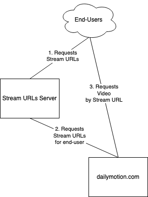
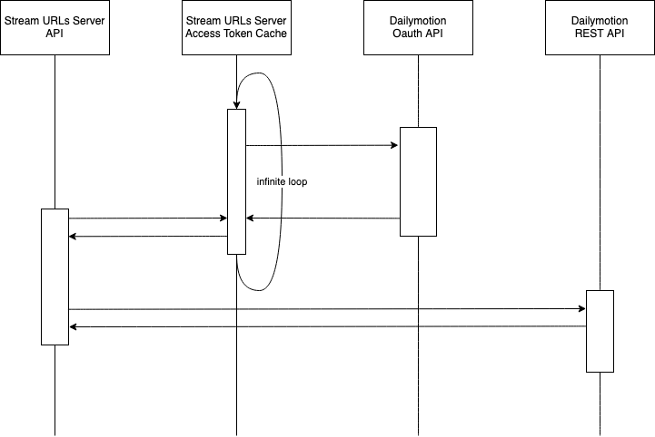

# Demo: Dailymotion Stream URLs server

## Architecture

## Requirements

- [GIT](https://git-scm.com/)
- (either) [Make](https://en.wikipedia.org/wiki/Make_(software)) and [Docker](https://www.docker.com/)
- (or) A local version of python 3.11 with [PDM](https://pdm.fming.dev) and a [Redis](https://redis.io) server
- Private API credentials

## Installation

- Clone the project on your server and, if outside of Docker, run `pdm install`.
- Store your private API credentials in `.secrets/dailymotion_api_credentials.json` with the following format:

        {
            "DAILYMOTION_API_KEY_ID": "<client_id>",
            "DAILYMOTION_API_KEY_SECRET": "<client_secret>"
        }

## Usage

### Start the application

#### Docker installation

Run `make up` on the server.

#### Local installation

_**Note**: you need a Redis server. You can start one by launching `make up-redis` but it requires Make and Docker._

Launch `bin/refresh-access-token-cache.sh` in a seperate terminal, or as a daemon.

Then run `bin/start-api.sh`. 

### Fetch stream URLs

From your client browse to
`http://<your-server-ip>:8000/stream-urls?video_id=<video_id>&video_formats=<format1<,format2>>`

#### Note About End-User IP

The Stream URLs Server gets the end-user IP address from the HTTP request made by the latter.

It can also read the IP address as an additional query string parameter: `&client_ip=<client_ip>`.

#### Note About HLS

HLS stream urls may not work locally due to CORS

## Workflow

